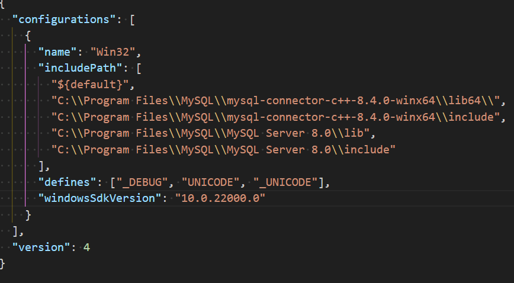
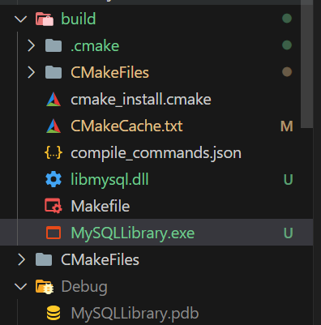

[](https://opensource.org/licenses/MIT)

# MySQL Connector + C++ Project(Library Management)

This project demonstrates how to connect to a MySQL database using C++ and the MySQL Connector. It includes basic operations such as connecting to the database, executing queries, and fetching results.

## Requirements

- C++ Compiler (e.g., `g++` from MinGW or MSYS2 on Windows)
- MySQL Server
- MySQL Connector/C++ libraries
- CMake (optional, if you use a build system)
- Visual Studio Code (optional, for code editing and task management)

## Setup

### Install MySQL Server

1. Download and install MySQL Server from the [official website](https://dev.mysql.com/downloads/mysql/).
2. Set up your MySQL instance and note down the username, password, and database name.

### Install MySQL Connector/C++

1. Download and install MySQL Connector/C++ from the [official website](https://dev.mysql.com/downloads/connector/cpp/).
2. Make sure to note the installation directory as you will need to link against these libraries.

### Install MSYS2 (for Windows users)

1. Download and install MSYS2 from the [official website](https://www.msys2.org/).
2. Open MSYS2 terminal and update the package database:

   ```sh

   pacman -Syu

   ```

### To build in Visual Studio Code

Use `CTRL + SHIFT + B` or `CTRL + SHIFT + P` -> Run Build Task

# Tasks.json (_Complier args_)


# c*cpp_properties(\_Include path*)



After that you may be able to run **mysqlversion_vs.exe**

```sh
start mysqlversion_vs.exe
```

# CMake

**To compile**

'''sh
cd mysqlversion_vs
cmake .
cd build
make
'''
!Don't forget `libmysql.dll`(without .dll the program will not start)



Replace `"username"`, `"password"`, and `"database_name"` with your actual MySQL credentials and database name in the sample code.
